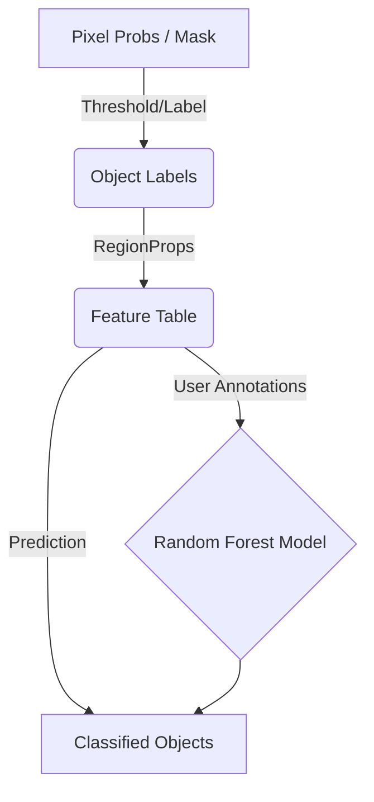

# Architecture

The **object-rf** plugin is structured into three main modules: GUI, Feature Extraction, and Classification.

## Core Modules

### 1. `ObjectWidget` (`src/object_rf/_widget.py`)
- Manages the state and user interactions.
- Integrates with napari's layers to fetch data.
- Handles threading via `napari.qt.threading.thread_worker` for feature extraction.

### 2. `FeatureExtractor` (Planned `src/object_rf/features.py`)
- Provides functions to compute morphological and intensity-based features.
- Uses `scikit-image.measure.regionprops` and `regionprops_table`.
- Returns pandas DataFrames/tables for training.

### 3. `ObjectClassifier` (Planned `src/object_rf/classifier.py`)
- A wrapper around `sklearn.ensemble.RandomForestClassifier`.
- Fits the model on provided features and annotations.
- Predicts class labels for new objects.

## Data Flow Diagram

## Key Decisions
- **Pandas Integration**: Features are stored in pandas DataFrames for easy visualization and compatibility with `scikit-learn`.
- **Properties Tables**: Object-level features are attached to napari's labels layer properties to enable interactive data exploration.
