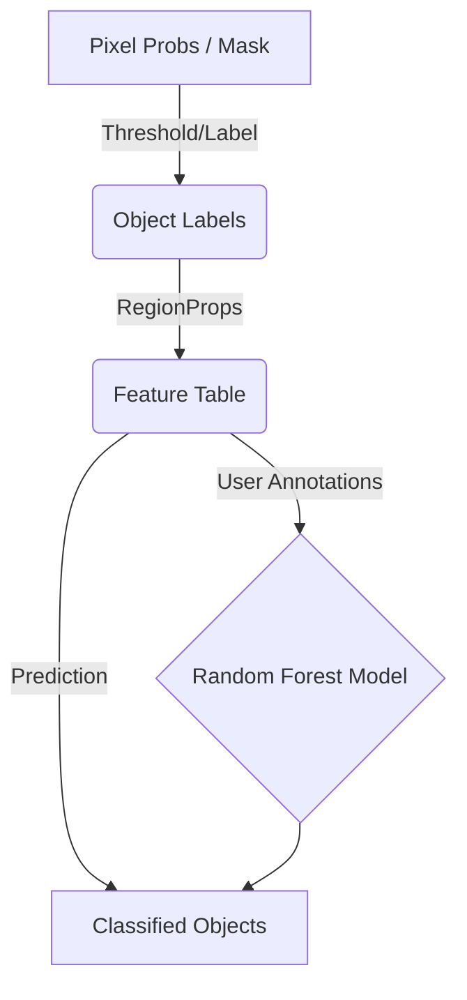

# Architecture

The **object-rf** plugin is structured into three main modules: GUI, Feature Extraction, and Classification.

## Core Modules

### 1. `ObjectWidget` (`src/object_rf/_widget.py`)
- Manages the state and user interactions.
- Integrates with napari's layers to fetch data.
- Handles threading via `napari.qt.threading.thread_worker` for feature extraction.

### 2. `FeatureExtractor` (Planned `src/object_rf/features.py`)
- Provides functions to compute morphological and intensity-based features.
- Uses `scikit-image.measure.regionprops` and `regionprops_table`.
- Returns pandas DataFrames/tables for training.

### 3. `ObjectClassifier` (Planned `src/object_rf/classifier.py`)
- A wrapper around `sklearn.ensemble.RandomForestClassifier`.
- Fits the model on provided features and annotations.
- Predicts class labels for new objects.

## Data Flow Diagram

## Segmentation Pipeline

To ensure high-quality object classification, `object-rf` uses a robust, multi-step pipeline to transform pixel-level probability maps into unique, clean object labels.

1.  **Probability to Mask (`argmax`)**:
    -   Probability stacks from `napari-rf` are converted to integer class maps by taking the `argmax` across the probability dimension (axis 1 for 3D, axis 0 for 2D).
    -   Foreground is defined as any pixel with a class ID > 0.
2.  **Morphological Pre-processing**:
    -   `binary_fill_holes` is applied to ensure objects are solid. For 3D stacks, this is performed slice-by-slice to preserve axial structures while filling internal gaps.
3.  **Initial Object Labeling**:
    -   `skimage.measure.label` generates unique integer IDs for all connected components.
4.  **Automated Size Filtering (Noise Removal)**:
    -   **Log-Transformation**: Areas of all initial objects are converted to `log10` space to compress high-magnitude variance and highlight scale-based differences.
    -   **Clustering (K-Means)**: `KMeans(n_clusters=2)` separates objects into "Noise" and "Signal" populations based on their log-areas.
    -   **Optimization (SVM)**: A linear Support Vector Machine (`SVC`) is trained on the log-areas to find the optimal decision boundary that best separates the two clusters.
    -   **Thresholding**: Objects with areas below the SVM boundary are discarded, effectively removing false positives from the pixel-level classifier.
5.  **Dilation**:
    -   The remaining objects are dilated (Radius 1: `ball` for 3D, `disk` for 2D) using `morphology.dilation`. This ensures the object boundaries encompass the full intensity transition zones, improving feature extraction accuracy.
6.  **Sequential Relabeling**:
    -   `segmentation.relabel_sequential` is used to ensure label IDs are continuous (1 to $N$) and synchronized with the internal feature matrix.
